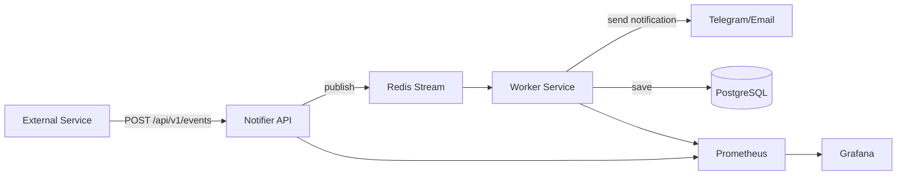

# notification-service (In progress)
[](https://go.dev/)
[](https://github.com/gratefultolord/notification-service/actions)
[](https://opensource.org/licenses/MIT)
[](https://github.com/gratefultolord/notification-service/actions)
[](https://github.com/gratefultolord/notification-service/actions)
[](https://codecov.io/gh/gratefultolord/notification-service)

Notification system with event-driven architecture.
It consumes events from external services, processes them asynchronously via Redis Streams and sends notifications.

## Features
- Receive external events via REST API (`/api/v1/events`)
- Asynchronous processing using Redis Streams
- Modular event handlers for different notification types
- Scheduled background tasks (cron jobs)
- Monitoring and metrics with **Prometheus + Grafana**
- Logging and tracing via **Sentry + Jaeger**
- CI/CD pipeline using **GitHub Acitons**

## Architecture


## Tech Stack
|   Component      | Technology          |
|------------------|---------------------|
| Language         | Go 1.24             |
| Database         | PostgreSQL          |
| Message queue    | Redis               |
| Containerization | Docker              |
| Monitoring       | Prometheus, Grafana |
| Linting          | golangci-lint       |
| CI/CD            | GitHub Actions      |
| API Definition   | OpenAPI v3          |

## Getting started
**1. Clone the repository**
```bash
git clone https://github.com/gratefultolord/notification-service.git
cd notification-service
```

**2. Run services**
```bash
make up
```

Available services:
- API: http://localhost:8080
- Prometheus: http://localhost:9090
- Grafana: http://localhost:3000

**3. Run migrations**
```bash
make migrate-up
```

**4. Send a test event**
```bash
curl -X POST http://localhost:8080/api/v1/events \
    -H "Content-Type: application/json" \
    -d  '{
        "id": "d5eaa43b-8e12-4b79-90a8-3410f8b1ff91",
        "type": "user_registered",
        "payload": "{\"user_id\": 123, \"email\": \"user@mail.com\"}",
        "created_at": "2023-10-24T21:25:00Z"
    }'
```

## Project Structure
```bash
cmd/
  notifier/     # HTTP API service
  worker/       # background worker
internal/
  api/          # routes, handlers
  queue/        # Redis Streams integration
  db/           # PostgreSQL operations
  tasks/        # event processors
  monitoring/   # metrics and logging
configs/        # app configs, Prometheus setup, etc
scripts/        # migration scripts and utilities
```

## Metrics
Prometheus scrapes metrics from `/metrics`
- `notifier_requests_total` - number of received events
- `worker_jobs_total` - number of processed jobs
- `worker_jobs_failed_total` - number of failed jobs
- `worker_processing_duration_seconds` - event processing duration

## Makefile Commands
|   Command         | Description                  |
|-------------------|------------------------------|
| `make build`      | Build all binaries           |
| `make test`       | Run tests                    |
| `make lint`       | Run linters                  |
| `make up`         | Start all containers         |
| `make down`       | Stop all containers          |
| `make migrate-up` | Apply migrations             |
| `make all`        | Build,test and lint together |

## License
MIT License - see [LICENSE](https://github.com/gratefultolord/notification-service/blob/main/LICENSE)

Maintainer - [Shukurillo Karimov](https://github.com/gratefultolord)